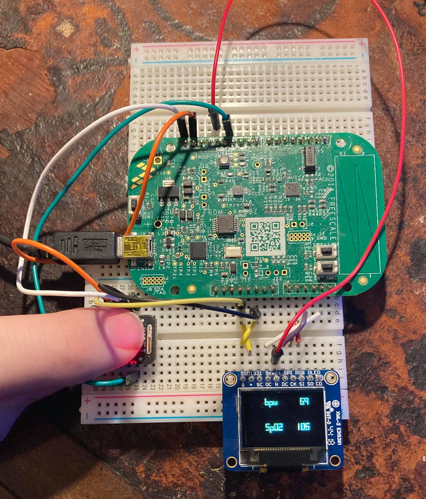

Dugie Graham-Campbell / wdg25 / Sidney Sussex

# PPG: SpO2 and BPM on Warp platform
This system was submitted as coursework for 4B25 Embedded Systems module at Cambridge University (2020). The specific aims of this project were to build a system capable of returning key health metrics in a COVID-19 context. This firmware is designed for use on a on a FRDM KL03 board, implimented with MAX30102 PPG sensor and Adafruit SSD1331 OLED display. This implimentation returns heart rate (BPM) and blood oxygenation (SpO2) periodically to the user, calculated from filtered signals from the PPG sensor. A detailed description of this can be found at `/doc/Report.pdf`. 



## Source Files
This project was built on a stripped-down version of the [Warp firmware](https://github.com/physical-computation/Warp-firmware) developed by the University of Cambridge's [Physical Computation Laboratory](http://physcomp.eng.cam.ac.uk). Phillip Stanley-Marbell and Martin Rinard. “A Hardware Platform for Efficient Multi-Modal Sensing with Adaptive Approximation”. ArXiv e-prints (2018). arXiv:1804.09241.

The following files are changed from the base firmware:

##### `warp-kl03-ksdk1.1-boot.c`
Contains `main{ }` loop which continiously returns BPM/SpO2 when a finger is detected. Many functions from original firmware have been removed; Signal filtering/analysis and  reporting functions have been added.

##### `devMAX30102.*`
Driver for MAX30102 PPG Sensor. Collects Red and IR absorbance values over I2C.

##### `devSSD1331.*`
Driver for the SSD1331 OLED display was modified to include character writing commands adapted from [here](https://github.com/lawjb/heart-rate-monitor/blob/master/src/boot/ksdk1.1.0/devSSD1331.c).

##### `CMakeLists.txt`
Removed various drivers from CMake configuration file.
> **NOTE:** Modifying the stack size will result in the firmware image size exceeding the KL03 memory size, preventing compiling. 

##### `warp.h`
Removed/modified various functions, data structures.

##### `build.sh`
Removed various drivers that otherwise would be copied into KSDK tree during build.

## 2. Pin configuration
The FRDM KL03 evaluation board is connected to the [SSD1331 display](https://www.adafruit.com/product/684) and the [MAX30102 PPG sensor](https://www.smart-prototyping.com/Pulse-Oximeter-and-Heart-Rate-Sensor-MAX30102) via the following pins:

### OLED display:

| OLED  | FRDM-KL03|
| ------------- |:-------------:|
|  GND      | GND     |
|   VCC     |    3.3V   |
|   OSC     |    PTB13   |
|    RST    |   PTB0    |
|   D/C     |    PTA2   |
|    SCK    |    PTA9   |
|     MOSI   |    PTA8   |

### PPG sensor:

| MAX30102  | FRDM-KL03|
| ------------- |:-------------:|
|  GND      | GND     |
|   VCC     |    3.3V   |
|   SCL     |    PTB3   |
|    SDA    |   PTB4    |
|   Interrupt     |    PTA7   |

**NOTE:** Interrupt not used in current build. If used, the pin needs to be pulled up to 3.3V with resistor (e.g. 10k)

# Building the modified [Warp](https://github.com/physical-computation/Warp-hardware) firmware

**Prerequisites:** You need an arm cross-compiler such as `arm-none-eabi-gcc` installed as well as a working `cmake` (installed, e.g., via `apt-get` on Linux or via [MacPorts](https://www.macports.org) on macOS). You will also need an installed copy of the SEGGER [JLink commander](https://www.segger.com/downloads/jlink/), `JlinkExe`, which is available for Linux, macOS, and Windows (here are direct links for downloading it for [macOS](https://www.segger.com/downloads/jlink/JLink_MacOSX.pkg), and [Linux tgz 64-bit](https://www.segger.com/downloads/jlink/JLink_Linux_x86_64.tgz)).

## 1.  Compiling the Warp firmware
First, make sure the environment variable `ARMGCC_DIR` is set correctly (you can check whether this is set correctly, e.g., via `echo $ARMGCC_DIR`; if this is unfamiliar, see [here](http://homepages.uc.edu/~thomam/Intro_Unix_Text/Env_Vars.html) or [here](https://www2.cs.duke.edu/csl/docs/csh.html)). If your `arm-none-eabi-gcc` is in `/usr/local/bin/arm-none-eabi-gcc`, then you want to set  `ARMGCC_DIR` to `/usr/local`. If your shell is `tcsh`:
```
  setenv ARMGCC_DIR <full path to the directory containing bin/arm-none-eabi-gcc>
```
Alternatively, if your shell is `bash`
```
  export ARMGCC_DIR=<full path to the directory containing bin/arm-none-eabi-gcc>
```
Second, edit the jlink command file, `tools/scripts/jlink.commands` to include the correct path.

Third, you should be able to build the Warp firmware by

	cd build/ksdk1.1/
	./build.sh

This copies the files from `Warp/src/boot/ksdk1.1.0/` into the KSDK tree, builds, and converts the binary to SREC. See 	`Warp/src/boot/ksdk1.1.0/README.md` for more. 


 
Fourth, you will need two terminal windows. In one shell window, run the firmware downloader:
```
  JLinkExe -device MKL03Z32XXX4 -if SWD -speed 100000 -CommanderScript ../../tools/scripts/jlink.commands
```
In the other shell window, launch the JLink RTT client<sup>&nbsp;<a href="#Notes">See note 1 below</a></sup>:

	JLinkRTTClient

## 2. Using the Warp firmware on the Freescale FRDMKL03 Board
The SEGGER firmware allows you to use SEGGER’s JLink software to load your own firmware to the board, even without using their specialized JLink programming cables. You can find the SEGGER firmware at the SEGGER Page for [OpenSDA firmware](https://www.segger.com/products/debug-probes/j-link/models/other-j-links/opensda-sda-v2/).


## 3.  Editing the firmware
The firmware is currently all in `src/boot/ksdk1.1.0/`, in particular, see `src/boot/ksdk1.1.0/warp-kl03-ksdk1.1-boot.c` and the per-sensor drivers in `src/boot/ksdk1.1.0/dev*.[c,h]`. Do not edit these files in `build/ksdk1.1/`, as these are overwritten during each build.

The firmware builds on the Kinetis SDK. You can find more documentation on the Kinetis SDK in the document [doc/Kinetis SDK v.1.1 API Reference Manual.pdf](https://github.com/physical-computation/Warp-firmware/blob/master/doc/Kinetis%20SDK%20v.1.1%20API%20Reference%20Manual.pdf). For more details about the structure of the firmware, see [src/boot/ksdk1.1.0/README.md](src/boot/ksdk1.1.0/README.md).

## 4.  Teminal
When the firmware boots, BPM, SpO2 and SSq Values will periodically be printed to the terminal. 

----


### Acknowledgements
Warp firmware is developed by Phillip Stanley-Marbell, Martin Rinard and the University of Cambridge's Physical Computation Laboratory.


----
### Notes
<sup>1</sup>&nbsp; On some Unix platforms, the `JLinkRTTClient` has a double echo of characters you type in. You can prevent this by configuring your terminal program to not echo the characters you type. To achieve this on `bash`, use `stty -echo` from the terminal. Alternatively, rather than using the `JLinkRTTClient`, you can use a `telnet` program: `telnet localhost 19021`. This avoids the JLink RTT Client's "double echo" behavior but you will then need a carriage return (&crarr;) for your input to be sent to the board. Also see [Python SEGGER RTT library from Square, Inc.](https://github.com/square/pylink/blob/master/examples/rtt.py) (thanks to [Thomas Garry](https://github.com/tidge27) for the pointer).
